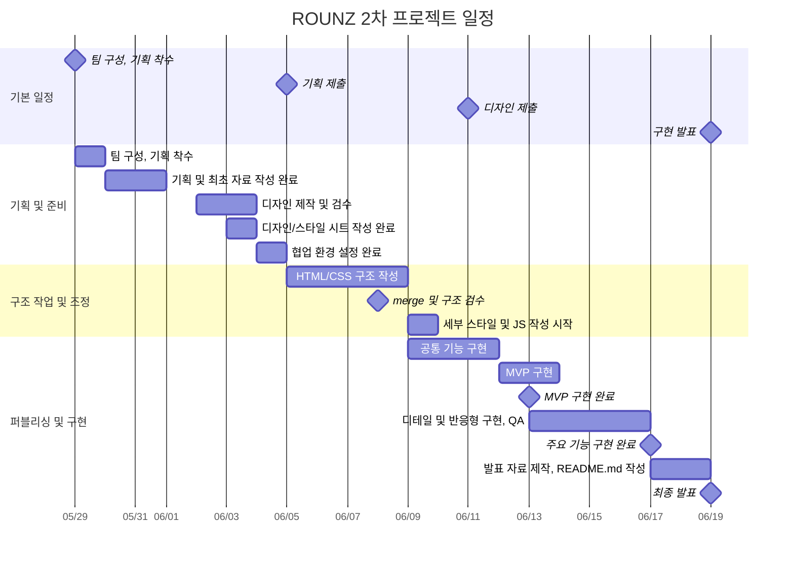

# ROUNZ 모바일 퍼스트 반응형 페이지 리뉴얼

> 실제 안경 커머스 서비스 [ROUNZ](https://rounz.com/home.php?categoryIndex=1001)를 모바일 퍼스트 관점으로 재해석한 팀 프로젝트입니다.

## 1. 프로젝트 소개

### 📌 프로젝트 개요

아이웨어 플랫폼 라운즈는 O2O 전략과 AI 기반 AR 가상 피팅으로 혁신적인 상품 체험을 제공한다. `ROUNZ 반응형 페이지 리뉴얼`은 기존 ROUNZ 서비스의 주요 사용자 흐름을 분석하고, 모바일 환경에서 더 빠르게 탐색하고 구매까지 이어질 수 있도록 반응형 웹 환경에 맞춰 재구성하는 것이 목표이다. 메인, 상품 목록, 상품 상세, 장바구니, 매장 찾기, 로그인/회원가입 페이지를 구현한 동적 웹 프로젝트입니다. 이를 통해 최적의 상품 탐색 및 구매가 가능하도록 사용자 경험을 대폭 개선하고자 한다.

### 🎯 프로젝트 목표

- 실제 서비스의 정보 구조와 커머스 흐름을 기반으로 페이지 리뉴얼
- 모바일 우선 UI를 설계하고 태블릿/데스크톱까지 대응하는 반응형 레이아웃 구현
- JSON 데이터 기반의 상품 렌더링, 필터, 정렬, 장바구니 흐름 구현
- LocalStorage와 Kakao Map API를 활용한 사용자 상태 관리 및 매장 찾기 경험 구현
- 공통 Header, Footer, Product Card 컴포넌트 분리로 페이지 간 일관성 유지

## 2. 개발 기간

| 구분           | 기간                    |
| -------------- | ----------------------- |
| 전체 진행 기간 | 2026.05.29 ~ 2026.06.19 |
| 구현 집중 기간 | 2026.06.12 ~ 2026.06.19 |
| 프로젝트 유형  | 팀 프로젝트             |

## 3. 팀원 소개

| 이름 | 담당 페이지 | 담당 기능 |
| --- | --- | --- |
| 박소영 | 상품 목록, 공통 컴포넌트, 프로젝트 관리 | 상품 카드 컴포넌트, 필터/정렬, 더보기, Header, 공통 스타일, 데이터 크롤링, PR 병합, 브랜치 관리, 통합 검수 |
| 이채연 | 메인 페이지 | 히어로 배너, BEST FRAME, AR 섹션, 컬렉션, 셀럽픽, 스토어 섹션 |
| 주후산 | 상품 상세 페이지 | 상품 상세 데이터 렌더링, URL query 기반 상세 진입, CTA, 유사 상품, Swiper 슬라이드 |
| 맹예진 | 장바구니, 매장 찾기 | LocalStorage 장바구니, 수량/금액 계산, 모달, Kakao Map API, 매장 검색/필터 |
| 김기용 | 로그인, 회원가입, Footer, Sidebar | 로그인/회원가입 폼 검증, 약관 모달, Footer, Sidebar |

### 🗓 마일스톤

> 최초 제작 계획은 2026.06.18 종료 기준이었으나, 최종 발표 일정이 2026.06.19로 변경되어 발표 준비 및 발표 일정을 추가 반영했습니다.



| 단계                   | 기간                    | 주요 내용                                                         |
| ---------------------- | ----------------------- | ----------------------------------------------------------------- |
| 기획 및 준비           | 2026.05.29 ~ 2026.06.04 | 팀 구성, 사이트 분석, 기획 자료 작성, 디자인 검수, 협업 환경 세팅 |
| 구조 작업 및 조정      | 2026.06.05 ~ 2026.06.09 | HTML/CSS 구조 작성, merge 및 구조 검수, 세부 스타일/JS 작업 착수  |
| 퍼블리싱 및 구현       | 2026.06.09 ~ 2026.06.17 | 공통 기능, MVP, 페이지별 주요 기능, 반응형 구현 및 QA             |
| 발표 준비 및 최종 발표 | 2026.06.17 ~ 2026.06.19 | 발표 자료 제작, README.md 작성, 최종 시연 및 발표                 |

## 4. 기술 스택

| 분류         | 기술                   |
| ------------ | ---------------------- |
| Markup       | HTML5                  |
| Styling      | SCSS, CSS3             |
| Language     | JavaScript ES Modules  |
| Data         | JSON, LocalStorage     |
| API          | Kakao Map API          |
| Library      | Swiper, Material Icons |
| Tool         | Figma, Git, GitHub     |
| Data Utility | Axios, Cheerio         |

## 5. 주요 기능

### 🏠 메인 페이지

- JSON 기반 히어로 배너 동적 렌더링
- Swiper를 활용한 메인 배너, 컬렉션, 셀럽픽 슬라이드
- BEST FRAME 상품 카드 렌더링 및 장바구니 연동
- AR & FACE ANALYSIS 소개 섹션 및 앱 다운로드 링크 제공
- ROUNZ STORE 섹션에서 매장 찾기 페이지로 이동
- 모바일/태블릿/데스크톱 반응형 레이아웃 구현

### 🕶 상품 목록 페이지

- `products.json` 기반 상품 리스트 렌더링
- 상품 카드 이미지 슬라이드 및 장바구니 담기 토스트
- 카테고리, 품절 제외, 브랜드, 원산지 필터 구현
- 최신순, 인기순, 리뷰 많은 순, 낮은 가격순, 높은 가격순 정렬
- 더보기 버튼 기반 페이지네이션
- 공통 상품 카드 컴포넌트 재사용

### 🔍 상품 상세 페이지

- URL query string의 상품 ID를 기준으로 상세 데이터 로드
- 상품 이미지, 가격, 할인율, 브랜드, 리뷰/찜 정보 동적 렌더링
- 수량 증가/감소 및 총 상품 금액 자동 계산
- 장바구니 담기 및 구매 버튼 장바구니 이동 처리
- 다른 컬러, 유사 상품, 컬렉션 슬라이드 구현
- 상세 정보/후기/문의/구매 정보 탭 UI 구현
- 화면 폭에 따라 상세 페이지 레이아웃 재배치

### 🛒 장바구니 페이지

- LocalStorage 기반 장바구니 데이터 관리
- 상품 수량 증가 및 감소
- 총 금액 자동 계산
- 상품 삭제 기능
- 쿠폰 적용 기능
- 모달 컴포넌트 구현
- 품절 상품 주문 제한 처리
- 배송 예정일 자동 표시

### 🗺 매장 찾기 페이지

- 카카오맵 API 연동
- 커스텀 오버레이 구현
- 관심 매장 기능
- 매장 검색 기능
- 반응형 바텀시트 구현
- 전체/예약 매장/관심 매장 필터
- 매장 리스트 클릭 시 지도 중심 이동
- LocalStorage 기반 관심 매장 저장

### 👤 로그인/회원가입 페이지

- 로그인 입력값 미입력 검증
- 회원가입 필수 입력값 및 비밀번호 일치 여부 검증
- 전체 동의/개별 약관 동의 체크박스 연동
- 필수 약관 동의 여부 검증
- 약관 상세 보기 모달 구현
- 회원가입 완료 화면 전환

## 6. 트러블 슈팅

GitHub 협업 기록의 `fix`, `refactor`, `docs`, `feat` 커밋 흐름을 기준으로 페이지별 문제와 해결 과정을 정리했습니다.

### 🏠 메인 페이지

| 문제                                                            | 원인 분석                                                                                              | 해결                                                                                   |
| --------------------------------------------------------------- | ------------------------------------------------------------------------------------------------------ | -------------------------------------------------------------------------------------- |
| 메인 배너/베스트 상품 데이터 경로가 맞지 않아 렌더링이 불안정함 | 메인 페이지에서 JSON 파일을 불러오는 경로와 실제 `data` 폴더 구조가 변경되면서 `fetch()` 경로가 어긋남 | `main_page_sunglasses.json`, `products.json` 경로를 정리하고 섹션별 렌더링 함수를 분리 |
| 컬렉션/셀럽 섹션 반응형 배치가 깨짐                             | Swiper 슬라이드 개수와 카드 너비가 모바일/데스크톱에서 동일하게 적용되어 화면 폭별 밀도가 맞지 않음    | Swiper `breakpoints`를 적용하고 SCSS에서 섹션별 레이아웃을 재조정                      |

### 🕶 상품 목록 페이지

| 문제                                                  | 원인 분석                                                                                       | 해결                                                                                           |
| ----------------------------------------------------- | ----------------------------------------------------------------------------------------------- | ---------------------------------------------------------------------------------------------- |
| 상품 데이터가 로드되지 않거나 페이지 이동 경로가 깨짐 | `sub` 폴더 기준 상대 경로와 루트 기준 상대 경로가 섞여 `fetch()` 및 상세 페이지 링크가 불안정함 | `../data/products.json` 기준으로 데이터 경로를 정리하고 상세 페이지 URL query 이동 경로를 수정 |
| 정렬 옵션 클릭이 제대로 동작하지 않음                 | 라디오 input, label, li 클릭 영역이 분리되어 실제 사용자가 누르는 영역과 이벤트 대상이 달랐음   | 정렬 옵션의 클릭 이벤트 범위를 `li` 단위로 확장하고 선택값을 기준으로 `filteredData`를 재정렬  |

### 🔍 상품 상세 페이지

| 문제                                                | 원인 분석                                                                | 해결                                                                                        |
| --------------------------------------------------- | ------------------------------------------------------------------------ | ------------------------------------------------------------------------------------------- |
| 상품 상세 페이지가 특정 상품을 정확히 불러오지 못함 | 상세 페이지가 정적 마크업 중심으로 시작되어 상품 ID 전달 구조가 부족했음 | URL query string의 `id` 값을 읽어 `products.json`의 `productIndex`와 매칭하는 방식으로 변경 |
| 품절 상품 또는 잘못된 접근 시 CTA 흐름이 어색함     | 장바구니/구매 버튼이 상품 상태를 고려하지 않고 동일하게 동작함           | 품절 상품 예외 처리, 수량 초기화, 장바구니 이동 로직을 추가해 CTA 사용성을 보완             |

### 🛒 장바구니 페이지

| 문제                                                  | 원인 분석                                                                                  | 해결                                                                                                  |
| ----------------------------------------------------- | ------------------------------------------------------------------------------------------ | ----------------------------------------------------------------------------------------------------- |
| 수량 변경 후 총 금액과 장바구니 개수가 즉시 맞지 않음 | LocalStorage 데이터, 화면 렌더링, 합계 계산 함수가 각각 따로 실행되어 상태 동기화가 늦어짐 | 수량 변경 시 `saveCartItems()`, `renderCart()`, `totalCartCount()`, `updateTotalAmount()`를 함께 호출 |
| 상품 이미지 클릭 시 상세 페이지로 연결되지 않음       | 장바구니에 저장된 상품 데이터에 상세 페이지 이동에 필요한 `productIndex` 활용이 부족함     | 장바구니 상품 이미지 링크를 `product-detail.html?id=상품ID` 형식으로 연결                             |

### 🗺 매장 찾기 페이지

| 문제                                                         | 원인 분석                                                                          | 해결                                                                                            |
| ------------------------------------------------------------ | ---------------------------------------------------------------------------------- | ----------------------------------------------------------------------------------------------- |
| 관심 매장 버튼 상태가 리스트와 지도 오버레이에서 다르게 보임 | 리스트와 커스텀 오버레이가 별도로 렌더링되어 관심 매장 상태를 각각 관리하려고 했음 | `favoriteStores` Set을 LocalStorage와 연결하고, 변경 시 리스트/오버레이를 함께 재렌더링         |
| 지도 오버레이 클릭/더블클릭 시 지도 이벤트와 충돌함          | 커스텀 오버레이 내부 클릭 이벤트가 지도 클릭 이벤트로 전파됨                       | 오버레이 내부 이벤트 전파를 제한하고, 매장 선택 시 기존 오버레이를 제거한 뒤 새 오버레이만 표시 |

### 👤 로그인/회원가입 페이지

| 문제                                                        | 원인 분석                                                                           | 해결                                                                            |
| ----------------------------------------------------------- | ----------------------------------------------------------------------------------- | ------------------------------------------------------------------------------- |
| 필수 입력값이 비어 있어도 사용자에게 명확한 피드백이 부족함 | 초기 구현은 화면 구성 중심이어서 입력 검증과 오류 메시지 노출이 충분하지 않았음     | 로그인/회원가입 입력값 검증, 오류 메시지 표시, `input_error` 스타일 토글을 추가 |
| Footer가 화면 하단에 안정적으로 붙지 않음                   | 로그인/회원가입 페이지는 콘텐츠 높이가 짧아 Footer가 중간에 떠 보이는 문제가 발생함 | 페이지 레이아웃과 Footer 여백을 조정해 짧은 화면에서도 하단 정렬되도록 수정     |

### 🧩 공통 컴포넌트

| 문제                                               | 원인 분석                                                                         | 해결                                                                                |
| -------------------------------------------------- | --------------------------------------------------------------------------------- | ----------------------------------------------------------------------------------- |
| Header/Footer 링크가 페이지마다 다른 위치로 이동함 | 루트 페이지와 `sub` 페이지의 상대 경로 깊이가 달라 공통 컴포넌트 내부 링크가 깨짐 | `getBasePath()` 유틸로 현재 페이지 깊이를 계산해 공통 컴포넌트 링크에 적용          |
| Header와 Sidebar 병합 후 스타일 충돌이 발생함      | 여러 페이지에서 공통 SCSS와 페이지별 SCSS가 동시에 수정되며 우선순위가 흔들림     | 컴포넌트 SCSS/CSS를 정리하고 Header sticky, 햄버거 애니메이션, Footer 스타일을 분리 |

## 7. 폴더 구조

```text
est_fe_13_2nd_project/
├── .vscode/
│   └── settings.json
├── css/
│   ├── cart.css
│   ├── common.css
│   ├── component.css
│   ├── index.css
│   ├── map.css
│   ├── normalize.css
│   ├── product-detail.css
│   ├── product-detail.css.map
│   ├── product-list.css
│   ├── reset.css
│   ├── sign-in.css
│   ├── sign-in.css.map
│   ├── sign-up.css
│   └── utilities.css
├── data/
│   ├── addCoordinates.js
│   ├── celeb.json
│   ├── collections_list.json
│   ├── crawl-rounz.js
│   ├── face-shape-analysis.json
│   ├── main_page_sunglasses.json
│   ├── products.json
│   └── stores.json
├── images/
│   ├── apple_store.png
│   ├── ar_qr.png
│   ├── ar_video.mp4
│   ├── Completion.png
│   ├── footer_1.png
│   ├── footer_2.png
│   ├── footer_3.png
│   ├── footer_4.png
│   ├── google.png
│   ├── google_store.png
│   ├── kakao.png
│   ├── m_ar_bg.png
│   ├── naver.jpeg
│   ├── pc_ar_bg.png
│   ├── promotion.jpg
│   ├── rzstore.png
│   ├── side_bar_1.png
│   ├── side_bar_2.png
│   ├── side_bar_3.png
│   ├── side_bar_4.png
│   └── t_ar_bg.png
├── js/
│   ├── components/
│   │   ├── common.js
│   │   ├── footer.js
│   │   ├── header.js
│   │   ├── product-card.js
│   │   └── side-bar-test.js
│   ├── cart.js
│   ├── main.js
│   ├── map.js
│   ├── product-detail.js
│   ├── product-list.js
│   ├── sign_in.js
│   └── sign_up.js
├── scss/
│   ├── _mixins.scss
│   ├── cart.scss
│   ├── common.scss
│   ├── component.scss
│   ├── index.scss
│   ├── map.scss
│   ├── normalize.scss
│   ├── product-detail.scss
│   ├── product-list.scss
│   ├── reset.scss
│   ├── sign-in.scss
│   ├── sign-up.scss
│   └── utilities.scss
├── sub/
│   ├── cart.html
│   ├── map.html
│   ├── product-detail.html
│   ├── product-list.html
│   ├── sign-in.html
│   └── sign-up.html
├── .gitignore
├── index.html
├── package-lock.json
├── package.json
├── README.md
└── test.html
```

## 8. 실행 방법

### ✅ 권장 실행 방법

`fetch()`로 로컬 JSON을 불러오기 때문에 VS Code Live Server 또는 정적 서버 환경에서 실행하는 것을 권장합니다.

```bash
# 저장소 클론
git clone https://github.com/s0-p/est_fe_13_2nd_project.git

# 프로젝트 폴더 이동
cd est_fe_13_2nd_project

# 의존성 설치
npm install
```

이후 VS Code에서 `index.html`을 Live Server로 실행합니다.

### 주요 페이지

| 페이지    | 경로                                 |
| --------- | ------------------------------------ |
| 메인      | `index.html`                         |
| 상품 목록 | `sub/product-list.html`              |
| 상품 상세 | `sub/product-detail.html?id=3003222` |
| 장바구니  | `sub/cart.html`                      |
| 매장 찾기 | `sub/map.html`                       |
| 로그인    | `sub/sign-in.html`                   |
| 회원가입  | `sub/sign-up.html`                   |

## 9. 프로젝트 회고

### 💡 프로젝트를 통해 배운 점

- 실제 서비스의 복잡한 커머스 흐름을 페이지 단위로 나누고, 공통 컴포넌트로 연결하는 경험을 할 수 있었습니다.
- LocalStorage를 활용해 페이지 이동 후에도 장바구니와 관심 매장 상태를 유지하는 방법을 익혔습니다.
- Kakao Map API, Swiper, JSON 데이터 렌더링을 실제 UI에 결합하며 외부 API와 라이브러리의 초기화 타이밍을 이해했습니다.
- 모바일 퍼스트로 설계한 뒤 데스크톱까지 확장하는 과정에서 반응형 레이아웃의 구조 설계가 중요하다는 점을 배웠습니다.

### 🤝 협업 과정에서 느낀 점

- 페이지별 담당을 분리하되 Header, Footer, 상품 카드, 공통 유틸처럼 공유되는 영역은 규칙을 먼저 맞추는 것이 중요했습니다.
- Git 브랜치와 PR을 통해 기능 단위로 병합하면서 충돌을 줄이고 작업 흐름을 관리할 수 있었습니다.
- 같은 데이터를 여러 페이지에서 사용하면서 데이터 구조와 네이밍을 맞추는 일이 협업 효율에 큰 영향을 준다는 것을 느꼈습니다.
- 실제 서비스 리뉴얼 프로젝트는 UI 구현뿐 아니라 사용자 이동 경로, 데이터 연결, 예외 처리까지 함께 고려해야 완성도가 높아진다는 점을 배웠습니다.
