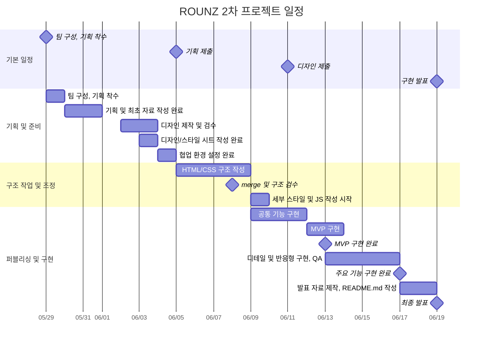

# ROUNZ 모바일 퍼스트 반응형 페이지 리뉴얼

> 실제 라운즈 웹페이지 [ROUNZ](https://rounz.com/home.php?categoryIndex=1001)

🔗 **리뉴얼한 웹페이지 링크** : [ROUNZ | F5](https://s0-p.github.io/est_fe_13_2nd_project/)

### 주요 페이지

| 페이지    | URL                                                                                                           |
| --------- | ------------------------------------------------------------------------------------------------------------- |
| 메인      | [index.html](https://s0-p.github.io/est_fe_13_2nd_project/)                                                   |
| 상품 목록 | [product-list.html](https://s0-p.github.io/est_fe_13_2nd_project/product-list.html)                           |
| 상품 상세 | [product-detail.html?id=3003222](https://s0-p.github.io/est_fe_13_2nd_project/product-detail.html?id=3003222) |
| 장바구니  | [cart.html](https://s0-p.github.io/est_fe_13_2nd_project/cart.html)                                           |
| 매장 찾기 | [map.html](https://s0-p.github.io/est_fe_13_2nd_project/map.html)                                             |
| 로그인    | [sign-in.html](https://s0-p.github.io/est_fe_13_2nd_project/sign-in.html)                                     |
| 회원가입  | [sign-up.html](https://s0-p.github.io/est_fe_13_2nd_project/sign-up.html)                                     |

## 1. 프로젝트 소개

### 📌 프로젝트 개요

아이웨어 플랫폼 라운즈는 O2O 전략과 AI 기반 AR 가상 피팅으로 혁신적인 상품 체험을 제공한다. `ROUNZ 반응형 페이지 리뉴얼`은 기존 ROUNZ 서비스의 주요 사용자 흐름을 분석하고, 모바일 환경에서 더 빠르게 탐색하고 구매까지 이어질 수 있도록 반응형 웹 환경에 맞춰 재구성하는 것이 목표이다. 메인, 상품 목록, 상품 상세, 장바구니, 매장 찾기, 로그인/회원가입 페이지를 구현한 동적 웹 프로젝트입니다. 이를 통해 최적의 상품 탐색 및 구매가 가능하도록 사용자 경험을 대폭 개선하고자 한다.

### 🎯 프로젝트 목표

- 실제 서비스의 정보 구조와 커머스 흐름을 기반으로 페이지 리뉴얼
- 모바일 우선 UI를 설계하고 태블릿/데스크톱까지 대응하는 반응형 레이아웃 구현
- JSON 데이터 기반의 상품 렌더링, 필터, 정렬, 장바구니 흐름 구현
- LocalStorage와 Kakao Map API를 활용한 사용자 상태 관리 및 매장 찾기 경험 구현
- 공통 Header, Footer, Product Card 컴포넌트 분리로 페이지 간 일관성 유지

## 2. 개발 기간

| 구분           | 기간                    |
| -------------- | ----------------------- |
| 전체 진행 기간 | 2026.05.29 ~ 2026.06.19 |
| 구현 집중 기간 | 2026.06.12 ~ 2026.06.19 |
| 프로젝트 유형  | 팀 프로젝트             |

## 3. 팀원 소개

| 이름                 | 담당 페이지                       | 담당 기능                                                                          | 추가 담당 업무                  |
| -------------------- | --------------------------------- | ---------------------------------------------------------------------------------- | ------------------------------- |
| 박&#8288;소&#8288;영 | 상품 목록,<br>공통 컴포넌트       | 상품 카드 컴포넌트, 필터/정렬, 더보기, Header, 공통 스타일, 데이터 크롤링          | PR 병합, 브랜치 관리, 통합 검수 |
| 이&#8288;채&#8288;연 | 메인 페이지                       | 히어로 배너, BEST FRAME, AR 섹션, 컬렉션, 셀럽픽, 스토어 섹션                      | 디자인 리드, 회의록 작성        |
| 주&#8288;후&#8288;산 | 상품 상세 페이지                  | 상품 상세 데이터 렌더링, URL query 기반 상세 진입, CTA, 유사 상품, Swiper 슬라이드 |
| 맹&#8288;예&#8288;진 | 장바구니, 매장 찾기               | LocalStorage 장바구니, 수량/금액 계산, 모달, Kakao Map API, 매장 검색/필터         |
| 김&#8288;기&#8288;용 | 로그인, 회원가입, Footer, Sidebar | 로그인/회원가입 폼 검증, 약관 모달, Footer, Sidebar                                |

### 🗓 마일스톤



| 단계                   | 기간                    | 주요 내용                                                         |
| ---------------------- | ----------------------- | ----------------------------------------------------------------- |
| 기획 및 준비           | 2026.05.29 ~ 2026.06.04 | 팀 구성, 사이트 분석, 기획 자료 작성, 디자인 검수, 협업 환경 세팅 |
| 구조 작업 및 조정      | 2026.06.05 ~ 2026.06.09 | HTML/CSS 구조 작성, merge 및 구조 검수, 세부 스타일/JS 작업 착수  |
| 퍼블리싱 및 구현       | 2026.06.09 ~ 2026.06.17 | 공통 기능, MVP, 페이지별 주요 기능, 반응형 구현 및 QA             |
| 발표 준비 및 최종 발표 | 2026.06.17 ~ 2026.06.19 | 발표 자료 제작, README.md 작성, 최종 시연 및 발표                 |

## 4. 기술 스택

| 분류         | 기술                   |
| ------------ | ---------------------- |
| Markup       | HTML5                  |
| Styling      | SCSS, CSS3             |
| Language     | JavaScript ES Modules  |
| Data         | JSON, LocalStorage     |
| API          | Kakao Map API          |
| Library      | Swiper, Material Icons |
| Tool         | Figma, Git, GitHub     |
| Data Utility | Axios, Cheerio         |

## 5. 주요 기능

### 🏠 메인 페이지

- JSON 기반 히어로 배너 동적 렌더링
- Swiper를 활용한 메인 배너, 컬렉션, 셀럽픽 슬라이드
- BEST FRAME 상품 카드 렌더링 및 장바구니 연동
- AR & FACE ANALYSIS 소개 섹션 및 앱 다운로드 링크 제공
- ROUNZ STORE 섹션에서 매장 찾기 페이지로 이동
- 모바일/태블릿/데스크톱 반응형 레이아웃 구현

### 🕶 상품 목록 페이지

- `products.json` 기반 상품 리스트 렌더링
- 상품 카드 이미지 슬라이드 및 장바구니 담기 토스트
- 카테고리, 품절 제외, 브랜드, 원산지 필터 구현
- 최신순, 인기순, 리뷰 많은 순, 낮은 가격순, 높은 가격순 정렬
- 더보기 버튼 기반 페이지네이션
- 공통 상품 카드 컴포넌트 재사용

### 🔍 상품 상세 페이지

- URL query string의 상품 ID를 기준으로 상세 데이터 로드
- 상품 이미지, 가격, 할인율, 브랜드, 리뷰/찜 정보 동적 렌더링
- 수량 증가/감소 및 총 상품 금액 자동 계산
- 장바구니 담기 및 구매 버튼 장바구니 이동 처리
- 다른 컬러, 유사 상품, 컬렉션 슬라이드 구현
- 상세 정보/후기/문의/구매 정보 탭 UI 구현
- 화면 폭에 따라 상세 페이지 레이아웃 재배치

### 🛒 장바구니 페이지

- LocalStorage 기반 장바구니 데이터 관리
- 상품 수량 증가 및 감소
- 총 금액 자동 계산
- 상품 삭제 기능
- 쿠폰 적용 기능
- 모달 컴포넌트 구현
- 품절 상품 주문 제한 처리
- 배송 예정일 자동 표시

### 🗺 매장 찾기 페이지

- 카카오맵 API 연동
- 커스텀 오버레이 구현
- 관심 매장 기능
- 매장 검색 기능
- 반응형 바텀시트 구현
- 전체/예약 매장/관심 매장 필터
- 매장 리스트 클릭 시 지도 중심 이동
- LocalStorage 기반 관심 매장 저장

### 👤 로그인/회원가입 페이지

- 로그인 입력값 미입력 검증
- 회원가입 필수 입력값 및 비밀번호 일치 여부 검증
- 전체 동의/개별 약관 동의 체크박스 연동
- 필수 약관 동의 여부 검증
- 약관 상세 보기 모달 구현
- 회원가입 완료 화면 전환

## 6. 트러블 슈팅

구현 과정에서 발생한 문제를 기능 단위로 정리했습니다. 단순 오류 수정에 그치지 않고, 데이터 흐름과 공통 컴포넌트 구조를 함께 정리해 같은 문제가 반복되지 않도록 개선했습니다.

| 구분             | 문제 상황                                                                      | 원인                                                                                              | 해결 방법                                                                                                                       |
| ---------------- | ------------------------------------------------------------------------------ | ------------------------------------------------------------------------------------------------- | ------------------------------------------------------------------------------------------------------------------------------- |
| 데이터렌더링     | 메인, 상품 목록, 상품 상세 페이지에서 JSON 데이터가 간헐적으로 불러와지지 않음 | 페이지별 파일 위치가 달라지면서 `fetch()` 상대 경로가 서로 다르게 작성됨                          | HTML 파일을 루트 기준으로 정리하고, `data/products.json`, `data/main_page_sunglasses.json`처럼 데이터 경로를 일관되게 맞춤      |
| 상품상세진입     | 상품 카드 클릭 시 상세 페이지가 특정 상품 정보를 정확히 표시하지 못함          | 상세 페이지가 정적 마크업 중심으로 작성되어 상품 식별값을 전달받는 구조가 부족했음                | URL query string의 `id` 값을 읽고 `products.json`의 `productIndex`와 매칭해 상세 정보를 동적으로 렌더링                         |
| 필터/정렬        | 상품 목록의 정렬 옵션 클릭 영역이 좁고, 필터 적용 후 정렬 결과가 어긋남        | 라디오 버튼, 라벨, 리스트 아이템의 이벤트 대상이 분리되어 선택 상태와 렌더링 데이터가 따로 움직임 | 클릭 이벤트 범위를 옵션 항목 전체로 확장하고, 필터링된 데이터를 기준으로 정렬 로직이 다시 실행되도록 수정                       |
| 장바구니상태관리 | 수량 변경 후 총 금액, 상품 개수, LocalStorage 데이터가 즉시 동기화되지 않음    | 저장, 렌더링, 합계 계산 함수가 각각 따로 호출되어 화면 상태 갱신 순서가 불안정했음                | 수량 변경과 삭제 시 `saveCartItems()`, `renderCart()`, `totalCartCount()`, `updateTotalAmount()`를 함께 호출해 상태 흐름을 통합 |
| 매장찾기         | 관심 매장 상태가 리스트와 지도 오버레이에서 서로 다르게 표시됨                 | 리스트 UI와 지도 오버레이가 별도로 렌더링되어 같은 관심 매장 데이터를 공유하지 못함               | `favoriteStores` Set을 LocalStorage와 연결하고, 상태 변경 시 리스트와 오버레이를 함께 다시 렌더링                               |
| 공통컴포넌트     | Header, Footer, Sidebar 병합 후 페이지별 링크와 스타일이 충돌함                | 공통 컴포넌트가 여러 페이지에서 재사용되면서 링크 기준 경로와 CSS 우선순위가 흔들림               | 공통 컴포넌트 JS/CSS를 분리하고, Header sticky, 햄버거 메뉴, Sidebar, Footer 스타일을 역할별로 정리                             |
| 로그인/회원가입  | 필수 입력값 누락 시 사용자에게 명확한 피드백이 보이지 않음                     | 초기 구현이 화면 구성 중심이라 입력 검증과 에러 메시지 노출이 부족했음                            | 입력값 검증 조건을 추가하고, 오류 메시지와 `input_error` 스타일을 적용해 사용자가 수정할 위치를 바로 알 수 있게 개선            |

### 개선 포인트

- 페이지별로 흩어져 있던 데이터 접근 방식을 정리해 JSON 기반 렌더링 안정성을 높였습니다.
- LocalStorage를 사용하는 장바구니와 관심 매장은 저장, 렌더링, 화면 갱신 순서를 명확히 분리했습니다.
- 공통 컴포넌트를 Header, Footer, Sidebar, Product Card로 나누어 페이지 간 중복을 줄이고 유지보수성을 높였습니다.
- 모바일 퍼스트 레이아웃을 기준으로 Swiper, 상품 카드, 바텀시트 UI의 반응형 동작을 조정했습니다.

## 7. 폴더 구조

```text
est_fe_13_2nd_project/
├── css/                         # 컴파일된 CSS 파일
│   ├── common.css                # 공통 레이아웃 스타일
│   ├── component.css             # Header, Footer, 상품 카드 등 공통 컴포넌트 스타일
│   ├── index.css                 # 메인 페이지 스타일
│   ├── product-list.css          # 상품 목록 페이지 스타일
│   ├── product-detail.css        # 상품 상세 페이지 스타일
│   ├── cart.css                  # 장바구니 페이지 스타일
│   ├── map.css                   # 매장 찾기 페이지 스타일
│   ├── sign-in.css               # 로그인 페이지 스타일
│   ├── sign-up.css               # 회원가입 페이지 스타일
│   ├── reset.css
│   ├── normalize.css
│   └── utilities.css
├── data/                         # 페이지 렌더링에 사용하는 JSON 데이터와 데이터 가공 스크립트
│   ├── products.json             # 상품 목록/상세 데이터
│   ├── main_page_sunglasses.json # 메인 베스트 상품 데이터
│   ├── collections_list.json     # 컬렉션 데이터
│   ├── celeb.json                # 셀럽픽 데이터
│   ├── face-shape-analysis.json  # 얼굴형 분석 데이터
│   ├── stores.json               # 매장 찾기 데이터
│   ├── crawl-rounz.js
│   └── addCoordinates.js
├── images/                       # 배너, 아이콘, AR, Footer, Sidebar 이미지 및 영상
├── js/
│   ├── components/               # 재사용 컴포넌트
│   │   ├── common.js
│   │   ├── header.js
│   │   ├── footer.js
│   │   ├── product-card.js
│   │   └── side-bar.js
│   ├── main.js                   # 메인 페이지 기능
│   ├── product-list.js           # 상품 목록, 필터, 정렬 기능
│   ├── product-detail.js         # 상품 상세 렌더링 및 CTA 기능
│   ├── cart.js                   # 장바구니 LocalStorage 관리
│   ├── map.js                    # Kakao Map API 및 매장 찾기 기능
│   ├── sign_in.js                # 로그인 폼 검증
│   └── sign_up.js                # 회원가입 폼 검증
├── scss/                         # 원본 SCSS 파일
├── index.html                    # 메인 페이지
├── product-list.html             # 상품 목록 페이지
├── product-detail.html           # 상품 상세 페이지
├── cart.html                     # 장바구니 페이지
├── map.html                      # 매장 찾기 페이지
├── sign-in.html                  # 로그인 페이지
├── sign-up.html                  # 회원가입 페이지
├── package-lock.json
├── package.json
└── README.md
```

## 8. 프로젝트 회고

| 이름                 | 회고                                                                                                                                                                                                                                                                                                                          |
| -------------------- | ----------------------------------------------------------------------------------------------------------------------------------------------------------------------------------------------------------------------------------------------------------------------------------------------------------------------------- |
| 박&#8288;소&#8288;영 | 팀장으로서 실시간 소통에 집중했고, 팀원들의 협업으로 지체 없이 프로젝트를 완수할 수 있었습니다. 잦은 요청에도 적극적으로 발 맞추어 준 팀원들 덕분에 지치지 않을 수 있었습니다. 실무적으로는 모듈 설계와 데이터 가공 기술을 익힐 수 있었습니다. 기술적으로도, 리더로서도 한 단계 더 성장할 수 있었던 경험이었습니다.           |
| 이&#8288;채&#8288;연 | 팀장님 가이드에 맞춰 레이아웃을 구현하며 디자인과 퍼블리싱 연결성의 중요성을 깨달았습니다. 모듈이나 JSON 활용법도 자세히 배울 수 있었고, 팀원분들이 늦은 시간까지 실시간으로 피드백을 주고받아 주신 덕분에 소통의 중요성도 깊이 느꼈습니다. 여러모로 많은 것을 얻어가는 뜻깊은 프로젝트였습니다!                              |
| 주&#8288;후&#8288;산 | 팀원 모두가 하나의 공통 목표를 향해 지치지 않고 달성해 나아가기 위해 디스코드로 어려운 점과 부족한 점을 파악하고 깃허브를 적극 활용해 협업하였습니다. 실시간 소통으로 컨텍스트를 맞추고 작업 진척도를 투명하게 공유한 덕분에 일정에 차질 없이 계획했던 태스크를 대부분 마무리지을 수 있었습니다.                              |
| 김&#8288;기&#8288;용 | 즐거운 분위기에서 작업할 수 있어서 능률도 많이 올라가고 끝까지 재미있게 작업할 수 있었습니다. 그리고 리더십이 뛰어난 팀장님과 훌륭한 팀원들이 있어서 뒤처지는 사람 한 명 없이 다 같이 팀 프로젝트를 완성할 수 있었고 몰랐던 것들은 많이 배울 수 있는 기회였습니다.                                                            |
| 맹&#8288;예&#8288;진 | 팀원들과 적극적으로 소통하며 서로의 지식과 경험을 공유할 수 있었습니다. 특히 기능 구현 과정에서 발생한 문제들을 함께 고민하고 해결해 나가면서 개발 역량뿐만 아니라 협업 능력 또한 크게 향상시킬 수 있었습니다. 혼자였다면 어려웠을 문제들도 팀원들과 함께 할 수 있어 프로젝트 개발 프로세스를 더욱 깊이 이해할 수 있었습니다. |
